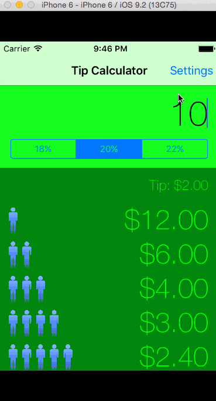

Tips Calculator app for Codepath
==============

Time spent: 10 hours total

Completed user stories 
* [x] Required: Basic tip calculator functionality
* [x] Required: Settings (on the same page)
* [x] Optional: View animation
* [x] Optional: Remember the bill amount across app restarts (within 60 seconds)
* [x] Optional: Conditionally segueing
* [x] Optional: Loading an image
* [x] Optional: Use a UITableView within an UIView
* [x] Optional: Creating cells dynamically within the UITableView

Did not complete: 
* [ ] Optional: Use locale specific currencies
* [ ] Optional: Light/dark color theme in settings view 

**Walkthrough of required and optional user stories:**

GIF created with [LiceCap](http://www.cockos.com/licecap/).